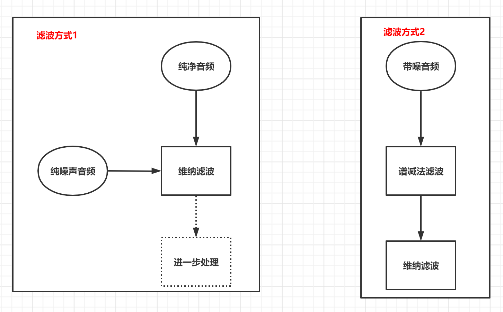
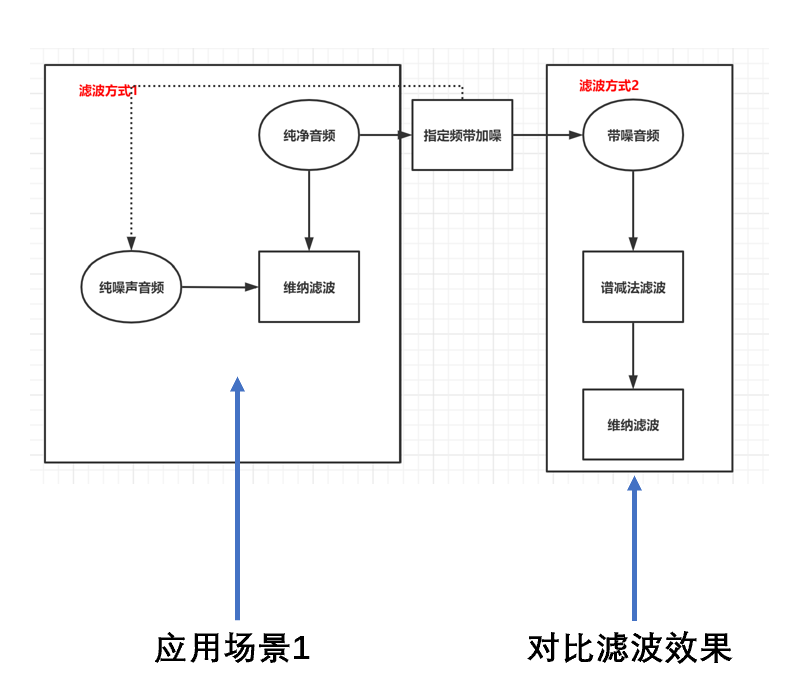
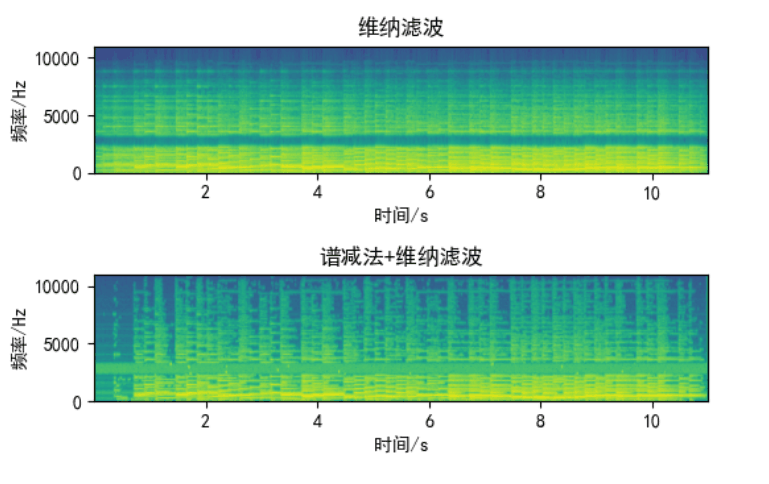
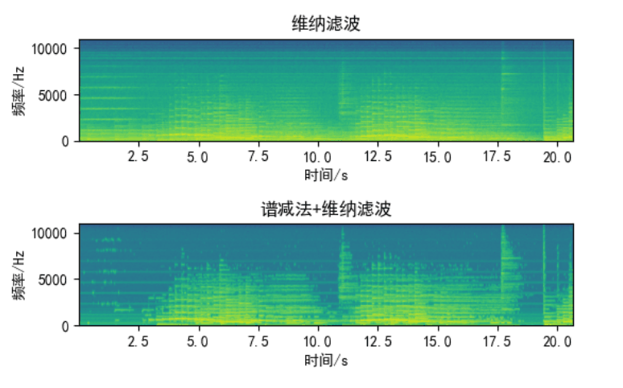

# 2022 华科电信数字语音处理课程项目——维纳滤波

### 环境配置

**<u>建议使用anaconda新建3.8版本的python虚拟环境</u>，python的virtualenv虚拟环境以及其他版本python未测试**

- 创建虚拟环境
  `$conda create -n ${envName} python=3.8`

- 安装必要库

  `$pip install matplotlib numpy librosa`

**完成环境后直接运行`python main.py`或`python demo.py`即可**

### 配置说明

- `main.py`

  大部分配置都在仓库中的`configs`文件夹下的`configs.py`中。其中`AUDIO_XXXX`的配置是用来存放`main.py`中相关的音频文件位置的，分别是原始纯净音频(`sound_original.wav`)、纯噪声`noise.wav`和带噪的音频`noisy_sound.wav`。

  由于是为了做实验演示，因此`main.py`中同样引用了纯净的音频和纯噪声。但`main.py`中的两种去噪方法分别是使用原始维纳滤波和先进行改进的谱减法再维纳滤波的方式进行的去噪，其中**后者的谱减法+维纳滤波的方式模拟的是给定一个未知的音频进行去噪的情景，因此如果修改代码直接读入带噪音频是可以直接输出结果的。读者如果有需求可以自行修改。**

- `demo.py`

  `demo.py`中的噪声为用户自己所加，可以自行修改，这是为了和`main.py`中的全频带噪声影响下的滤波效果进行对比所做(其频带范围与snr同样可以通过`NOISE_FREQUENCY_LOW`和`NOISE_FREQUENCY_HIGH`指定)。不过由于这部分主要是对比，因此文件位置均写在`demo.py`内，读者有需求可以自行修改。


### 实验详细介绍/实验报告

#### **1. 实验目的**

本实验想要实现的**主要目标**是对比**传统维纳滤波**和**混合使用谱减法与维纳滤波**两种方法对带噪音频的去噪效果。同时在进行这样的对比时，也使用了两类不同的音频数据作为输入进行了测试，该两类数据的区别如下：

- 第一类音频为输入纯净的语音，为其手动添加指定频段的一个高斯噪声得到需要滤波的带噪音频序列。

- 第二类音频为直接输入未知的混合有高斯白噪声的带噪音频序列，对两种滤波后的结果进行对比。

**注意由于传统的维纳滤波需要噪声的音频作为对比，因此实验中噪声部分是作为已知数据处理的，而纯净音频由于需要作为对比也作为已知数据，和最后滤波后的音频进行比较；但是在实验所模拟的场景中，这些数据是未知的**

#### **2. 实验原理**


---

**维纳滤波数学原理**

维纳滤波器中，假设输入信号为y(n)，干净信号和增强信号的差值为e(n)。设计滤波器h(n)，使得干净信号和增强信号的差值e(n)均方误差最小。按照该方法设计的滤波器则称之为维纳滤波器。具体方法如下：

- 对时域进行傅里叶变换，得到频域。由于傅里叶变换采用的是正交基，因此假设各个频段之间互不相关 可以针对每个频点k进行分析。
  $\hat{X}(\omega)=H(\omega)*Y(\omega)$			$\hat{X}(\omega_k)=H(\omega_k)\*Y(\omega_k)$	

- 误差如下：
  $E(\omega_k)=X(\omega_k)-\hat{X}(\omega_k)=X(\omega_k)-H(\omega_k)\*Y(\omega_k)$
  目的是让均方误差**E**$[|E(\omega_k)|^2]$最小，令        $P_{yy}(\omega_k)=$**E**$[|Y(w_k)|^2]$，     $P_{xy}(\omega_k)=$**E**$[Y(w_k)X(\omega_k)^*]$，

  则求导得最终结果**$H(\omega_k)=\frac{P_{xy}^*(\omega_k)}{P_{yy}(\omega_k)}$** 

**然而如上的$H(\omega_k)$在用于语音去噪时不常用，实际实现时会进行其他近似操作**

---

**用于语音去噪的维纳滤波推导**

$y(n)=x(n)+n(n)$       $Y(\omega_k)=X(\omega_k)+N(\omega_k)$

$ P_{xy}^\*(\omega_k)=\rm{E}[X(\omega_k)(X(\omega_k)+N(\omega_k))^\*]=\rm{E}[X(\omega_k)X^\*(\omega_k)]+\rm{E}[X(\omega_k)N^\*(\omega_k)] $

- **假设X与N互不相关，且N的期望值为0，那么：**

  $P_{xy}^\*(\omega_k)=P_{xx}^\*(\omega_k)$

  **同理可得：**

  $P_{yy}(\omega_k)=P_{xx}(\omega_k)+P_{nn}(\omega_k)$

  **于是：**

  $H(\omega_k)=\frac{P_{xx}(\omega_K)}{P_{xx}(\omega_k)+{P_{nn}(\omega_k)}}$

- 令$snr=\frac{P_{xx}(\omega_k)}{P_{nn}(\omega_k)}$为先验信噪比，则$H(\omega_k)=\frac{\xi_k}{\xi_k+1}$

- **实际代码实现中使用的是参数型维纳滤波器**，即$H(\omega_k)=(\frac{P_{xx}(\omega_K)}{P_{xx}(\omega_k)+\alpha{P_{nn}(\omega_k)}})^\beta$
  也即$H(\omega_k)=(\frac{\xi_k}{\xi_k+\alpha})^\beta$

---

**谱减法的数学原理**

$y(n)=x(n)+e(n)$       $Y(\omega)=X(\omega)+E(\omega)$

则$|\hat{X}(\omega)|=|Y(\omega)|-|E(\omega)|$，注意$|\hat{X}(\omega)|$在小于0时强制置为0

而$\hat{X}(\omega)=|\hat{X}(w)|e^{j{\phi}\_Y(\omega)}$

- 通常认为噪声为加性噪声，取语音开始的前一段作为噪声
- 谱减法实现过程
  - 将输入语音分帧进行短时傅里叶变换(STFT)
  - 取前N帧进行噪声估计
  $E(\omega)$
  - 谱减操作
  - ISTFT还原获取干净语音

**但是由于小于0时的截断导致了滤波后的语音引入新的失真，因此考虑如下过减法：**

- 先计算$P_x(\omega)=(P_Y(\omega)^\gamma-\alpha P_E(\omega)^\gamma)^{\frac{1}{\gamma}}$
- 然后$P_x(P_x(\omega)<\beta P_E(\omega))=\beta P_E(\omega)$
- $|X(\omega)|=\sqrt{P_x(\omega)}$

**仍然存在的问题是滤波后的部分语音不平滑，为此引入平滑机制**

- $max(\omega)=arg max \sum_{t=0}^{T_{noise}}E_t{\omega}-E(\omega)$
- 然后令$|X(|X(\omega)<max(\omega)|)|=arg min\sum_{t-k}^{t+k}|X_t(\omega)|$，这样对于过小的部分用相邻帧的最小值替代，达到平滑效果

**进行了如上两个优化操作的方法是代码中使用的方法**

---

**实验中使用的方法**

在实验的代码中分别对比了使用原生维纳滤波和先进行改进的谱减法再维纳滤波两种方式的去噪效果

#### 3.实验应用背景

维纳滤波的应用情况较为广泛，如下为本实验中所验证的其中一种应用背景：

- 如果已知噪声的某些分布特性，可以通过认为向干净语音加噪声的方法，获取训练得到的维纳滤波器，用得到的滤波器进行滤波。

  该情况对应实验代码中的`demo.py`和`main.py`中使用`Wiener`类进行的滤波处理，`demo.py`中使用的带噪音频为已知干净音频，为其添加指定频段的白噪声得到，而`main.py`中则加入的是全频带的白噪声。

- **干净语音未知的情况下**，可以用谱减法先进行噪声估计，再进行滤波。

  该情况对应实验代码中`demo.py`和`main.py`中使用`SubFilterUtil`类进度滤波处理，由于先使用了谱减法进行处理，因此噪声来源于带噪音频开始的一小段序列

**两种应用场景可大致表现如下：**



### 四、代码实现

**上一节介绍了应用背景，而在实验中分为两部分代码，分别对应两个应用场景，但是在实现其中一个应用场景时为了同时引入另一种滤波方式的效果对比，对流程进行了一定改动。两个运行文件对应的流程分别如下：**

**`demo.py`**



如图，需要模拟第一种应用场景（获取“训练的滤波器”），但是在模拟这种应用场景的同时希望也对比一下使用谱减法再维纳滤波的效果，因此做了一定的改动

**`main.py`**


如图，需要模拟第二种应用场景（直接对噪声音频进行滤波），但是在模拟这种应用场景的同时希望也对比一下使用普通维纳滤波的效果，因此需要引入第二种应用场景中**本不该存在的噪声和纯净音频**

---

#### 1. 音频数据的获取

该部分由小组另一人参与，最终获得了频率为32000Hz、单声道的wav文件，其中包含纯噪声、纯音频、带噪音频数据。

#### 2. 代码结构安排

为了使代码的安排合理且容易复用，本组实验中的代码可以大致分为文件部分、配置部分、工具类部分、主程序部分。其中各部分内容如下：

    **文件部分：**存放需要处理的音频文件，如纯净的输入音频序列、带噪的音频序列等。
    
    **配置部分：**包括了实验中需要设置的各类参数，如维纳滤波时中的α、β参数等。
    
    **工具类部分：**各个工具类封装了对音频序列的相关操作，如AudioUtil封装了对数据的读写等功能。
    
    **主程序部分：**负责调用其他各个部分，是进行最终测试的代码，包含了main.py和demo.py
    
    **具体的代码结构可见如下图：**


	其中resources和output文件夹包含的内容均为wav格式的音频文件，用于读取输入数据或者存入输出数据。
	
	**代码的调用关系则大致如下图：**

    对于配置的管理部分，为了结构的清晰将其拆分为了各部分的配置类。

#### 3. 参数选取

在实现第一部分的实验目的时需要引入人工噪声，有关噪声的参数设置为：

- $$f_{low}（噪声最低频率）= 2400Hz$$
- $f_{high}（噪声最高频率）= 3200Hz$
- snr = 5

有关维纳滤波器的参数设置如下：

- $N_{FFT}(傅里叶所选择的序列长度)=512$
- $\alpha=1$   $\beta=3$
- $N_{frame-shift-length}（帧移长度）= 256$
- $N_{window-length}（窗长）= 512$

有关加入了谱减法的维纳滤波器的参数设置如下：

- $N_{FFT}（傅里叶所选择的序列长度）= 512$
- $N_{frame-shift-length}（帧移长度）= 256$
- $\alpha=4$     $\beta=0.001$     $\gamma = 1$    $k=1$

     其他还包括有关数据的读入等相关配置，与实验效果无关，就不再列举

#### 4. 滤波算法实现

##### 开发环境：

- 软件环境：
  - 操作系统：windows10
  - 编程语言：python3.8
  - 第三方库：librosa，numpy，matplotlib，soundfile，scipy
- 硬件环境
  - 内存：16GB
  - 硬盘：固态硬盘512GB
  - cpu：11th Gen Intel(R) Core(TM) i5-11300H

##### 具体算法实现：

1. **原生维纳滤波核心代码：**

   生成滤波器：

   ```python
   S_clean = librosa.stft(data, n_fft=self.config.fft_length,
                                      hop_length=self.config.frame_shift_length, win_length=self.config.window_length)
               S_noise = librosa.stft(noise, n_fft=self.config.fft_length,
                                      hop_length=self.config.frame_shift_length, win_length=self.config.window_length)
               Pxx = np.mean((np.abs(S_clean)) ** 2, axis=1, keepdims=True)
               Pnn = np.mean((np.abs(S_noise)) ** 2, axis=1, keepdims=True)
               self.filter = (Pxx / (Pxx + self.config.alpha * Pnn)) ** self.config.beta
   ```

   进行滤波，其中`data`是需要滤波的音频：

   ```python
   S_data = librosa.stft(data, n_fft=self.config.fft_length,
                         hop_length=self.config.frame_shift_length, win_length=self.config.window_length)
   S_filtered = S_data * self.filter
   filtered_data = librosa.istft(S_filtered, hop_length=self.config.frame_shift_length,
                                 win_length=self.config.window_length)
   return filtered_data
   ```

2. 改进的谱减法核心代码：

   ```python
   """
           :param noise_data: data mixed with noise
           :param noise: pure noise
           :return:
           """
           noise = noise_data[:self.config.window_length*30]
           # 计算混合了噪声的数据的相关参数
           S_noise_data = librosa.stft(noise_data, n_fft=self.config.fft_length, hop_length=self.config.frame_shift_length,
                                       win_length=self.config.window_length)
           D, T = np.shape(S_noise_data)
           Magnitude_noise_data = np.abs(S_noise_data)
           Phase_noise_data = np.angle(S_noise_data)
           Power_noise_data = Magnitude_noise_data ** 2
   
           # 计算纯噪声的数据的相关参数（通常取未知待处理数据的前一小段部分作为噪声）
           S_noise = librosa.stft(noise, n_fft=self.config.fft_length, hop_length=self.config.frame_shift_length,
                                  win_length=self.config.window_length)
           Magnitude_noise = np.mean(np.abs(S_noise), axis=1, keepdims=True)
           Power_noise = Magnitude_noise ** 2
           Power_noise = np.tile(Power_noise, [1, T])
   
           # 引入部分平滑
           Magnitude_noise_data_new = np.copy(Magnitude_noise_data)
           for t in range(1, T - self.config.k):
               Magnitude_noise_data_new[:, t] = np.mean(Magnitude_noise_data[:, t - self.config.k:t + 1 + self.config.k],
                                                        axis=1)
           Power_noise_data = Magnitude_noise_data_new ** 2
   
           # 去噪
           Power_filtered_data = np.power(Power_noise_data, self.config.gamma) \
                                 - self.config.alpha * np.power(Power_noise, self.config.gamma)
           Power_filtered_data = np.power(Power_filtered_data, 1 / self.config.gamma)
   
           # 找到值过小的部分
           mask = (Power_filtered_data >= self.config.beta * Power_noise) - 0
           Power_filtered_data = mask * Power_filtered_data + self.config.beta * (1 - mask) * Power_noise
           Magnitude_filtered_data = np.sqrt(Power_filtered_data)
           Magnitude_filtered_data_new = np.copy(Magnitude_filtered_data)
   
           # 计算最大残差
           max_nr = np.max(np.abs(S_noise_data[:, :31]) - Magnitude_noise, axis=1)
   
           for t in range(1, T - 1):
               index = np.where(Magnitude_filtered_data[:, t] < max_nr)[0]
               temp = np.min(Magnitude_filtered_data[:, t - 1:t + 2], axis=1)
               Magnitude_filtered_data_new[index, t] = temp[index]
   
           S_filtered_data = Magnitude_filtered_data_new * np.exp(1j * Phase_noise_data)
           filtered_data = librosa.istft(S_filtered_data, hop_length=self.config.frame_shift_length,
                                         win_length=self.config.window_length)
           return filtered_data
   ```

### 实验效果

#### 1. 语谱图结果可视化

为了更加直观地展示实验的效果，实验中都做出了音频序列的语谱图。对于两类不同的数据，分别画出了原始音频、加噪音频、维纳滤波处理结果、改进的谱减法+维纳滤波处理结果4段音频的语谱图。

- 对于第一类音频（即输入是纯净音频，手动加噪后再处理的结果）

  如下为对音频处理前后的语谱图结果。

  

  由加噪后音频的语谱图可以明显看出在原始音频上增加了一个指定频带的噪声，在语谱图中表现为多出一条横向的频带；在维纳滤波后可以看出将噪声所在的频带被全部滤除，但是缺点是会使得频带不够平滑不够连续，出现了新的噪声；最后在使用了谱减法与维纳滤波的混合方法后既去除了噪声所在频带部分的信号，又进行了一定程度的平滑，但也损失了较多能量，对滤波后的音频序列进行放大即可。

- 对于第二类音频（即输入是带噪音频）

  这里需要明确虽然输入直接为带噪的音频，但是在同样读入了对应的纯噪声音频和纯净音频，其作用是作为对比。另外读入的纯噪声音频也作为了维纳滤波的参考噪声，而在谱减法与维纳滤波的混合法中，噪声则是取了输入的带噪音频的前30帧。

  如下为对音频处理前后的语谱图结果

  

  由于所加噪声为全频段的高斯噪声，因此观察加噪后的语谱图可以发现在全频段的语音信号强度均有增强；维纳滤波则是在一定程度上对高斯噪声进行了去除；改进的谱减法+维纳滤波则在去噪的同时保持了较好的平滑效果使音质保持的较好。

#### 2. 输出的语音序列

**<u>如果查看pdf报告可以直接点击附件中resources文件夹的原wav文件进行聆听，如查看markdown报告时需要保证附件中的文件路径正确</u>**

**使用加入了指定频段噪声的音频：**

- 如下各个音频含义如下：

  - `demo_sound_original.wav`：原始音频

    <audio src="resources/demo_sound_original.wav"></audio>

  - `demo_noisy_data.wav`：加噪音频

    <audio src="output/demo_noisy_data.wav"></audio>

  - `demo_wiener_filtered_data.wav`：维纳滤波结果

    <audio src="output/demo_wiener_filtered_data.wav"></audio>

  - `demo_wiener_subproc_filtered_data.wav`：改进谱减法+维纳滤波结果

    <audio src="output/demo_wiener_subproc_filtered_data.wav"></audio>

  

**使用加入全频带噪声的音频：**

- 如下各个音频含义如下：

  - `sound_original.wav`：原始音频

    <audio src="resources/sound_original.wav"></audio>

  - `noisy_sound.wav`：加噪音频

    <audio src="resources/noisy_sound.wav"></audio>

  - `wiener_filtered_data.wav`：维纳滤波结果

    <audio src="output/wiener_filtered_data.wav"></audio>

  - `wiener_subproc_filtered_data.wav`：改进谱减法+维纳滤波结果

    <audio src="output/wiener_subproc_filtered_data.wav"></audio>

